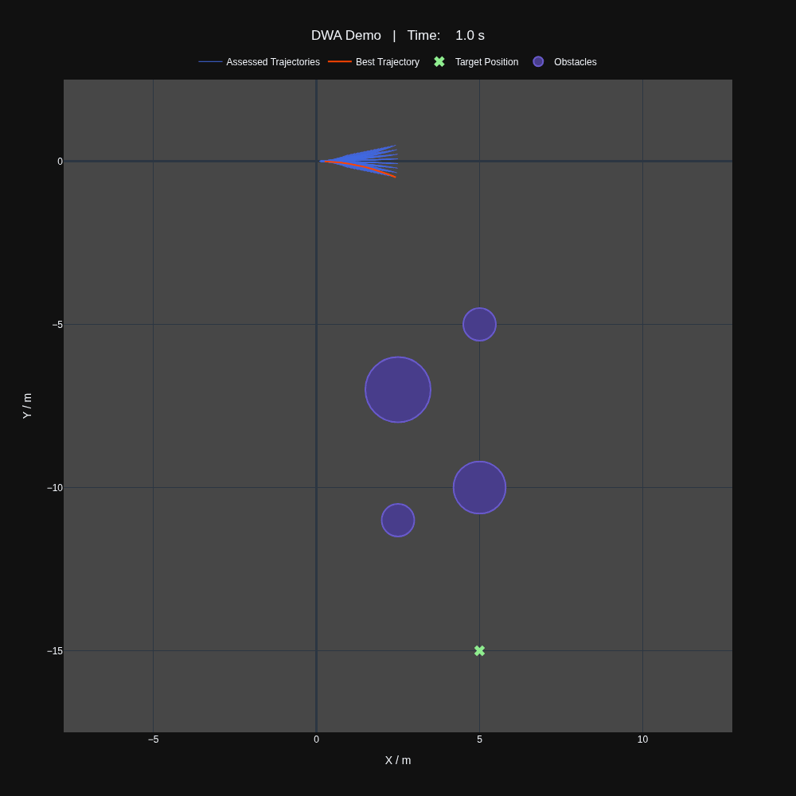

# Dynamic Window Approach Trajectory Planner

This project implements a trajectory planner for rovers using the Dynamic Window
Approach (DWA). The DWA is a popular method for real-time trajectory planning
that considers the rover's dynamics and the environment to generate feasible 
trajectories.

## Overview

The DWA algorithm computes possible trajectories based on the rover's current
state and velocity, evaluates them, and selects the optimal trajectory to
follow. This approach is particularly useful for mobile rovers navigating in
dynamic environments.

## Project Structure

```
dwa_demo
├── src
│   ├── run_dwa_demo.py         # ⏩ Entry point of the DWA demo application
│   ├── dwa
│   │   ├── planner.py          # 📈 Implementation of the trajectory planner
│   │   ├── animation.py        # 📊 Adds a class for visualising the planner
│   │   └── rover_data.py       # 🤖 Classes related to the rover
│   ├── tests
│   │   ├── test_rover_data.py  # 🔍 Unit tests for rover data classes
│   │   └── test_planner.py     # 💯 Unit tests for the trajectory planner
│   └── util
│       └── math.py             # 🛠 Utility functions for maths operations
├── pyproject.toml              # 🐍 Project dependencies and build config
└── README.md                   # 📖 Project documentation
```

## Setup

First make sure you have [uv](https://docs.astral.sh/uv/getting-started/installation/)
installed.

Then clone the repository and get uv to set up the virtual environment and
install the required dependencies:

```bash
git clone https://github.com/bbrayzier/dwa_demo.git
cd dwa_demo
uv sync
```

## Usage

To run the trajectory planner, simply execute the following command:

```bash
uv run -m src.run_dwa_demo
```

To change the characteristics of the rover, the planner or the target/obstacles
modify the constants at the top of [`run_dwa_demo.py`](src/run_dwa_demo.py).

## Animation

Running the project with the `-a` flag will generate an animation in the
`assets/` directory like that shown below.

```bash
uv run -m src.run_dwa_demo -a
```

This feature generates figures using the [plotly](https://plotly.com/python/)
library and stitches them into an animation using the
[gif](https://github.com/maxhumber/gif/tree/v3.0.0) library.

**Note:** this will significantly increase execution time of the demo.



## License

See the [LICENSE](LICENSE.md) file for license rights and limitations ([MIT](https://opensource.org/license/MIT)).
